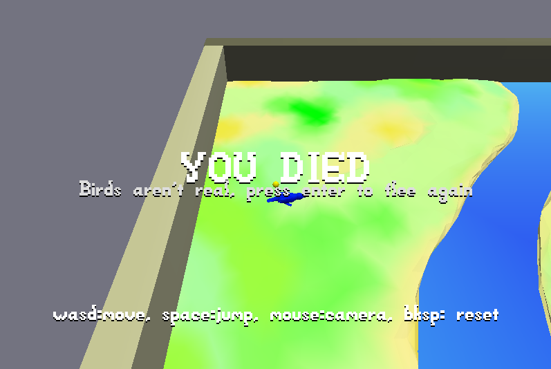

# Birds Aren't Real

Author: Margot Stewart (erstewar)

Design:  As a weird little pellet thing, flee from the bird in 3D space!

Screen Shot:

How To Play:

Use WASD to move on the XY plane and Space to jump.  The camera controls from the demo are still in place, but your movement isn't tied to camera orientation.
You lose if the bird catches you or your fall in the water.

Sources:

All assets that weren't from the demo are my own.

This game was built with [NEST](NEST.md).
